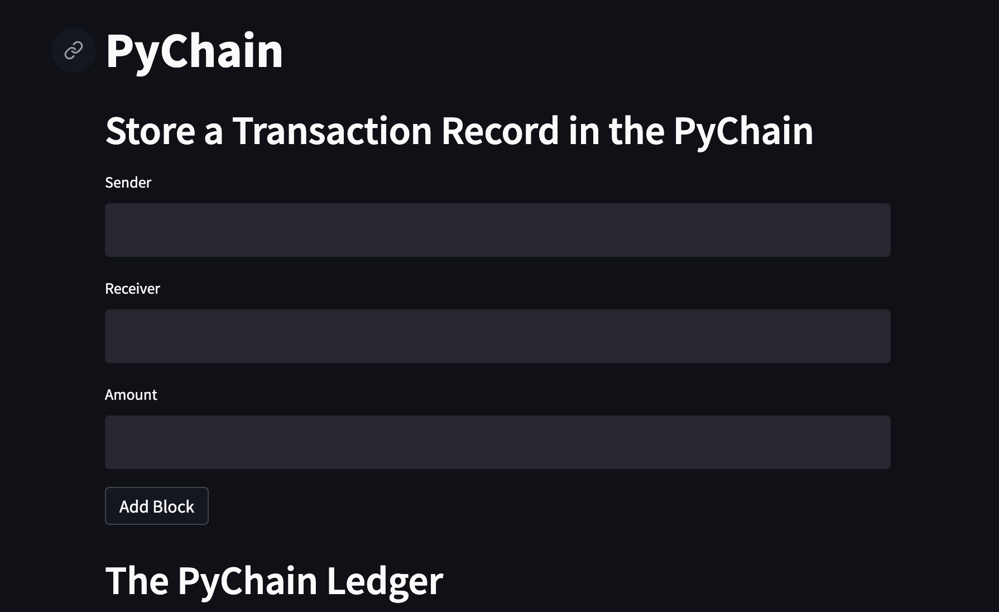

# Module 18 Block Chain with Python

## Utilizing Vscode we built a simple blockchain-based ledger system

###### To begin, we needed to upload/download all the necessary dependencies/libraries for the Streamlit:
>First we have the code for the environment
 ```from IPython.display import clear_output
try:
  pip install streamlit

```
>There after we have the other libaries

```import streamlit as st
from dataclasses import dataclass
from typing import Any, List
import datetime as datetime
import pandas as pd
import hashlib


```
>When running streamlit you must do the following in terminal

```
streamlit run app.py
```

###### From here, we begin complete the module

